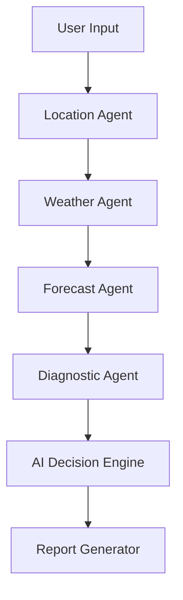

# 🧠 HVAC AI Agent – Autonomous Energy Optimization System

An **AI-powered HVAC optimization platform** that analyzes environmental conditions, building occupancy, and energy usage to recommend optimal HVAC settings and improve energy efficiency.

The system automatically detects building location, retrieves real-time weather conditions, predicts cooling load, analyzes HVAC performance, and generates a professional HVAC optimization report.

Developed for the **KIT Hackathon**.

---

## 📋 PROJECT OVERVIEW

Modern buildings consume a large portion of their energy through **HVAC systems**. Most HVAC units operate with fixed settings and do not adapt to real-time environmental conditions or occupancy levels.

This project introduces a **Multi-Agent AI Decision Engine** that automatically analyzes building conditions and recommends optimal HVAC settings to reduce energy consumption while maintaining thermal comfort.

### System Capabilities

• Automatic location detection from building address  
• Real-time weather analysis  
• Cooling load prediction  
• HVAC performance diagnostics  
• AI-based temperature optimization  
• Automated HVAC energy report generation  

---

## ⚠️ PROBLEM STATEMENT

Traditional HVAC systems lack intelligence and operate using static temperature settings.

These systems fail to consider:

• Outdoor temperature  
• Humidity  
• Building occupancy  
• HVAC system efficiency  

This leads to:

• Excessive energy consumption  
• Increased operational costs  
• Reduced HVAC efficiency  

An intelligent system is required to dynamically analyze environmental conditions and **optimize HVAC operations automatically**.

---

## 💡 PROPOSED SOLUTION

The **HVAC AI Agent** integrates multiple intelligent agents that work together to analyze environmental and building data.

Using **location intelligence, weather data, and predictive analytics**, the system estimates cooling demand and generates **smart HVAC recommendations**.

The result is an **AI-driven HVAC Optimization Report** that helps facility managers improve energy efficiency and reduce operational costs.

---

## 🏗️ MULTI-AGENT SYSTEM ARCHITECTURE



---

## 🤖 AI AGENTS

### 📍 Location Agent

• Converts building address into geographic coordinates  
• Uses **Google Maps Geocoding API**

Output

```
Latitude
Longitude
Formatted Address
```

---

### 🌦 Weather Agent

• Fetches real-time environmental conditions  
• Uses **OpenWeatherMap API**

Output

```
Outdoor Temperature
Humidity
Weather Description
```

---

### 📊 Forecast Agent

Predicts HVAC cooling demand and estimates monthly energy costs using:

• Outdoor temperature  
• Humidity  
• Building occupancy  

**Monthly Bill Calculation**  
It compares the base electricity cost (Non-Optimized) against the AI-driven cost (Optimized) assuming an ₹8/kWh tariff.

Output

```
Predicted Cooling Load
Monthly Bill (Optimized)
Monthly Bill (Non Optimized)
Estimated Monthly Savings
```

---

### ⚙ Diagnostic Agent

Analyzes HVAC system performance using:

• Energy consumption  
• HVAC efficiency (IKW/TR)

Output

```
System Diagnostic Status
```

---

### 🧠 AI Decision Engine

Combines results from all agents to determine:

• Recommended indoor temperature  
• Estimated energy savings  
• Optimal HVAC operation strategy  

---

### 📄 Report Agent

Generates a **clean HTML HVAC Optimization Report** displaying:

• Building information  
• Environmental conditions  
• Cooling load prediction  
• HVAC diagnostics  
• Recommended temperature  
• Energy savings  

---

## 💻 TECHNOLOGY STACK

### Backend

• Python  
• FastAPI  
• Jinja2 Templates  
• Google Maps Geocoding API  
• OpenWeatherMap API  

### Frontend

• HTML  
• CSS  
• JavaScript  

---

## 🔄 SYSTEM WORKFLOW

### Step 1 — User Input

User enters building information:

```
Building Name
Address
Occupancy
Indoor Temperature
Energy Consumption
IKW/TR
```

---

### Step 2 — Location Detection

Location Agent converts the address into geographic coordinates.

---

### Step 3 — Weather Detection

Weather Agent retrieves:

• Outdoor Temperature  
• Humidity  

---

### Step 4 — Cooling Prediction

Forecast Agent estimates HVAC cooling demand.

---

### Step 5 — HVAC Diagnostics

Diagnostic Agent evaluates HVAC system efficiency.

---

### Step 6 — AI Decision

AI Decision Engine determines optimal HVAC settings.

---

### Step 7 — Report Generation

Report Agent generates the **HVAC Optimization Report**.

---

## 🚀 HOW TO RUN THE PROJECT

### 1 Install Dependencies

```bash
pip install -r requirements.txt
```

---

### 2 Configure API Keys

Create a `.env` file inside the **backend folder**.

```env
GOOGLE_MAPS_API_KEY=your_google_maps_api_key
OPENWEATHER_API_KEY=your_openweather_api_key
```

---

### 3 Start Backend Server

```bash
python -m uvicorn app.main:app --reload
```

---

### 4 Open API

Visit

```
http://127.0.0.1:8000
```

---

### 5 Run Frontend

Open

```
frontend/index.html
```

in your browser.

---

## 📄 GENERATE HVAC REPORT

1 Enter building information  
2 Click **Generate Report**  
3 The system runs all AI agents  
4 The HVAC optimization report appears instantly  

---

## 📊 EXAMPLE OUTPUT

```
Building: SCET
Location: Coimbatore, Tamil Nadu

Outdoor Temperature: 34°C
Humidity: 65%

Predicted Cooling Load: 393 kW

System Diagnostic:
Efficiency Degradation Detected

Recommended Indoor Temperature: 24°C

Estimated Energy Savings: 12%
```

---

## ✨ KEY FEATURES

Automatic Location Detection  
Real-Time Weather Integration  
AI-Based Cooling Load Prediction  
HVAC Performance Diagnostics  
Smart Temperature Recommendation  
Automated Energy Optimization Report  

---

## 🏆 HACKATHON IMPACT

This project demonstrates how **AI-powered environmental intelligence** can transform traditional HVAC systems into **smart energy optimization platforms**.

By combining **location intelligence, weather data, and predictive analytics**, the system enables buildings to reduce energy consumption while maintaining indoor comfort.

---

## 🔮 FUTURE IMPROVEMENTS

Real-Time IoT Sensor Integration  
Machine Learning Cooling Load Models  
Smart Building Dashboard  
Automated HVAC Control Systems
